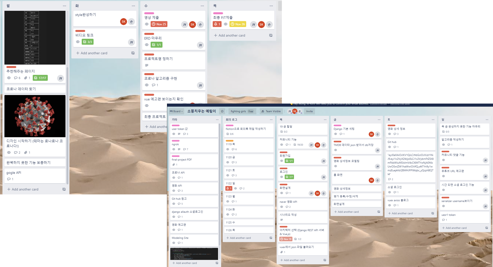
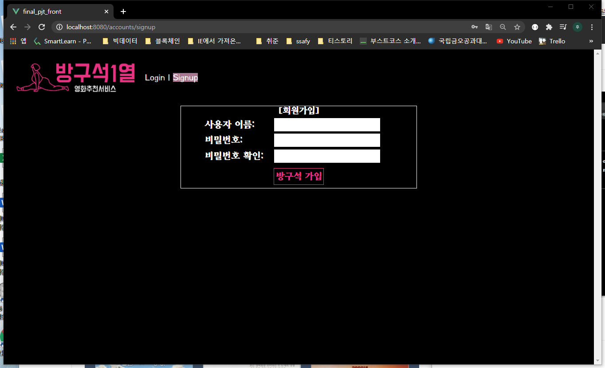

# 방구석 1열 fin_pjt (손동민, 권소진, 정예림)

## 1. 프로젝트 소개

영화 추천 웹 서비스

- TMDB API를 기반으로 수집한 인기영화 목록을 제공.
- 평점을 매긴 영화 장르를 분석해 유사한 장르 영화를 추천.
- 코로나 사태를 맞이하여 지역별 코로나 확진자 수와 함께 관심도를 기준으로 영화를 추천

## 2. 배포 서버 URL & 개발 환경

#### URL


#### 개발환경

- python
  - Python 3.7.7
  - Django 3.1.3
- Javascript
  - Vue.js
- Database
  - sqlite3

- 도구
  - vsCode
  - Chrome Browser
- 아키텍처
  - Django  REST API  서버 & Vue.js

## 3. 팀원 정보 및 업무 분담 내역

#### Together

- 기획
- 화면설계
- 시나리오 작성

#### Front-End

💩**손동민**

🐂**권소진**

#### Back-End

🦺**정예림**

	- 모델링
	- 일정관리(trello)
	- Django REST framework
	- API data 수집 , 전처리, DB저장
	- Youtube API , 크롤링
	- AndroidStudio Webview 구현

## 4. 목표 서비스 구현 및 실제 구현 정도

A. 관리자 뷰

	- django의 createsuperuser기능을 통해 권한을 설정
	- is_spersuer와 request.user를 통해 작성자와 관리자에 따라 권한을 설정하였다.
	- 관리자는 is_superuser로 모든 관리 가능.
	- 소셜 로그인을 계획 하였지만 구현하지 못함.

B. 영화 정보

- TMDB API를 통해 200개의 데이터를 수집 완료.
- 영화줄거리 뿐 아니라 Youtube API를 통해 예고편 보이는 기능 완료.
- 유튜브API중에 없는 데이터가 있었으나 시간부족으로 다 처리하지 못함. 중복되는 videoID부분도 DB에 넣고 발견하여 처리하지 못함.

C. 추천 알고리즘

- 영화 평가중 4개 이상을 획득한 영화의 장를 정보를 기준으로 비슷한 장르를 가진 영화를 추천.
- 사용자별 평가를 남긴 영화 목록과 해당 영화의 장르를 가지고 올수 있었지만 가장 중요한 기준인 4개 이상을 filter하지 못함.
- 중복되는 장르가 많아서 count 알고리즘을 통해 가장 많이 등장한 장르 2가지 선택

D. 커뮤니티

- 자유게시시판 처럼 user가 작성/수정/삭제 가능.
- admin 즉, 관리자는 모든 글과 댓글에 작성/수정/삭제 가능.


##### Trello를 활용한 일정관리 및 회의로그 작성




## 5. ERD


## 6. 기능 설명

- 로그인 페이지

  

- 회원가입

  

- 홈 화면

  

- 영화 디테일 화면 (댓글)

  

- 영화 디테일 화면 (예고편)

  

- 영화 디테일 화면 (줄거리)

  

- 커뮤니티 메인화면

  

- 커뮤니티 작성 및 댓글

  

- 지역별 코로나 확진자 수 및 테마별 영화 추천

  

  

- user별 평점 남긴 영화 데이터 기반 영화추천

  

## 7. 기타(느낀점) - 부제 : daily 개발 느낀점들

🦺**정예림**

- 처음으로 djago를 활용해 처음으로 데이터 수집 및 전처리 , 모델 작성 , 로직 구성등 수업에서 배운 내용을 한단계 나아간 많은 공부를 할 수 있었다.

- 주어진 모델을 활용하는 수준에 그쳤던 지난 날 보다 직접 manytomany,foreinkey등 관계형 데이터 베이스를 짜보면 많은 공부를 진행할 수 었었다.

- 직접 Google에서 직접 찾아보면서 몰랐거나 잊었던 개념을 익혔고 내가 원하는 데이터를 serializer할 수 있었다. 단순히 데이터를 보낸다 라는 의미에 두지 않고 최대한 백앤드에서 로직을 작성해서 front에 넘기기 위해 노력하였다.

- 이번 경험을 기반으로 back-end의 마음을 간접적으로 체험할 수 있었고 다음번에 front를 같은 마음가짐으로 목표 기능을 구현하기 위해 노력할것이다,

  

- 201120
  - 처음 받은 네이버 API는 줄거리가 포함되지 않아 설계한 거를 구현하기에는 데이터가 부족했다. 그래서 목요일에 받은 요청을 사용하지 않고 tmdb로 경로를변경하였다. 요청을 하면 될거라고 생각했지만 요청 받은 데이터를 json으로 변경해야헸고 받은 데이터를 db로 넣어야 하는 많은 단계가 있었다. 반 친구에게 받은 코드로 그냥 python으로 하면 json으로 잘 받아 왔지만 app안의 [views.py](http://views.py/)에 넣었을때 json 파일 생성조차 이루어 지지 않았다. 다른 코드를 참고하여 성공하였다. 하지만 해결 중에서도 model을 구성하는 부분에서 어려움을 겪었다.
  - 전에 배웠던 manytomany field 개념을 다시 익혔다. 한 영화는 여러 장르를 가지고 있다. 그래서 장르와 movie를 related_name을 통해 연결해 주었다. 들어간db를 확인하기 위해 opendatabase를 실행하였는데 실행이 되지 않아 당황했다. sqllite browser를 통해 들어간걸 확인할수 있었다. 찜찜한 느낌으로 검색중에 command 를 통해 sq;lite를 입력해서 열었더니 django안에서 열 수 있었다.

- 201121

  - 1, admin
    처음 관리자 기능을 구현할 때 pdf에 나와있는 말을 참고해서 django의 createsuperuser를 통해 관리자를 등록하였다.
    django와 vue의 연동하는 방법을 잘 이해하지 못해서 많은 시간을낭비 하였다. rest_framework를 다시 공부하였고 permission_classes를 이용하면 된다는 사실을 명확하게 이해할 수 있었다. | 를 통해 인증받은 사용자 or 관리자만 작성 수정 을 할 수 있게 설정하였다.
    **@permission_classes**([IsAuthenticated|IsAdminUser])

  - 하지만 추가적으로 권한에 오류가 발생하였다. 결국 permission을 custom 을 진행하였고, request.user (작성자 본인) ,is_superuser(관리자)를 통해 접근 권한을 나타내었다.

  - ```python
    if request.user.community.filter(pk=community.pk).exists() or request.user.is_superuser:
    ```

- 201122

  - serializer username 뜨게하기
    seriliazer는vue에서 데이터를 볼 수있게 만들어주는데 front에서 댓글을 단 user의 pk값이 아닌 username이 필요했다. 하지만 역참조를 통한 serializer는 user에 대한 정보를 pk값만 전달해주어 serializer의 수정이 필요했다.

    username = serializers.SerializerMethodField("getUsername")

    ```
    def getUsername(self, obj):
        return obj.user.username
    
    class Meta:
        model=Comment
        fields = ('id','rank','content','created_at','updated_at','user_id','username')
    ```

    username을 mehtodfield를 사용해서 함수를 만들어 username을 읽을 수 있는 username field를 추구하며 해결 할 수 있었다.

- 201123

  - 추천 알고리즘
    각 영화 마다 평점댓글을 적은 유저의 정보를 바탕으로 추천 알고리즘을 만들었다. 모델부터 역참조까지 생각보다 복잡한 db로 초반 모델링 부터 시간을 많이 사용하였다. 영화마다 평점을 남긴 유저는 쉽게 가져올수 있었지만 그 해당 유저 마다 좋아하는 영화를 또 알아야 하고 그 영화에 담긴 장르들을 다 알아야 했다. 그러면서 여러 모델을 다 파악해야했다.

  - 여기서 vue에 넘겨줄 떄 단순히 평점을 남긴 영화들의 장르들을 다 넘겨주는게 아니라 vue에서 좀더 쉽게 할 수 있도록 직접 장르들의 빈도수를 파악하고 그 빈도수를 기준으로 오름차순하요 뒤에서 2개 즉, 상위 2개 장르를 뽑아 serializer를 하였다. 기존에 했던 serializer는 존재하는 model을 기준으로 이용하거나 custom 을 하였다. 하지만 이번은 좀 더 복잡하게 직접 query즐 작성해야했다. 그래서 구글링하며 직접 query를 작성하였다.

  - ```python
        serializer1 = GenreSerializer(Genre.objects.get(pk=new1))
        queryset = [Genre.objects.get(pk=new1), Genre.objects.get(pk=new2)]
        print(queryset)
        serializer =  GenreSerializer(queryset, many=True)
        return Response(serializer.data)
    ```

- 201124

  - .video id를 가지고 왔다.
    tmdb에 유튜브 video id가 있다고 생각했지만 다시 요청하면서 알아보니 데이터가 변하면서 있는 데이터 없는 데이터가 있는걸 발견했다. 그래서 수업시간에 배웠던 유튜브 api 요청 기능을 통해 가져와야겠다고 생각했다. 처음에 계정당 100개의 요청수가 정해져있다는걸 까먹고 시험삼아 여러번 시도해서 다 모으기도 전에 요청 갯수를 다사용하고 말았다. 그래서 계정 3개를 통해 200개의 영화 데이터를 크롤링 하였다. 진행하다가 보니 tmdb api 데이터 처럼 없는 경우가 있었다. 다시 생각해보니 굳이 크롤링 하기보다 처음에 tmdb를 사용했다면 시간을 줄일 수 있자 않을까 라는 아쉬움이 남았다.
  - json 파일 변환
    데이터를 크롤링하고 json파일로 장하는 과정에서 설계를 잘못하여 데이터 형태와 구성 모두 복잡하게 되었다. 그래서 직접 변환하고 저장하는 과정에서 많은 시간이 소요되었다. vscode와 jupyter 왔다갔다 하는 과정이 추가 되다 보니
    json만 가져오는 시간보다 더 많이 소요되었다.